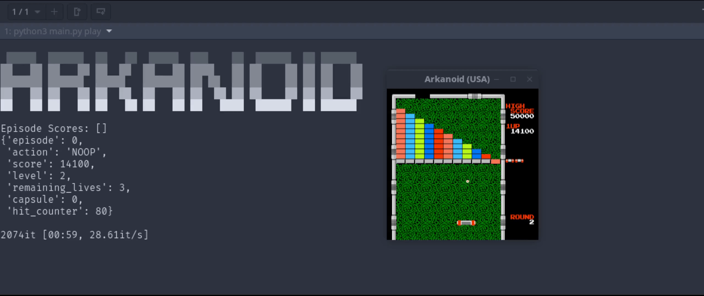

# Arkanoid Gym

Python playground to train an AI model to win at Arkanoid (NES)



## Install dependencies and run
This project uses python3.9+.

```
$ pip install -r requirements.txt
```

## Usage
```bash
$ python3 main.py play --help
Usage: main.py play [OPTIONS]

Options:
  --render / --no-render          [default: render]
  --fps INTEGER                   [default: 50]
  --episodes INTEGER              [default: 3]
  --frames INTEGER
  --agent [heuristic|dqn|qlearning|human]
                                  [default: heuristic]
```

- Select how many episodes to go through with `--episodes` or give a total amount of frames with `--frames`.

- Pause at any time by pressing `P` and change to keyboard mode by pressing `H`

- Choose your player! `--agent`

    - `human`: Play with the keyboard
    - `heuristic`: Play with a deterministic non-AI agent that should be pretty good
    - `dqn`: Try the Deep Q Network agent
    - `qlearning`: Try the simple Q-learning agent

## Train
```bash
Usage: main.py train [OPTIONS]

Options:
  --episodes INTEGER      [default: 1000]
  --batch-size INTEGER    [default: 128]
  --checkpoint-dir PATH   [default: checkpoints]
  --save-every INTEGER
  --resume / --no-resume  [default: no-resume]
  --help                  Show this message and exit.
```

You can select how many episodes to train the `DQN` agent with using `--episodes`.
`--batch-size` selects how many statuses/actions/rewards to sample from the replay memory to train on each frame.
`--checkpoint-dir` is the directory where the learned weights will be saved after training for usage when playing.
`--save-every` is used to saved intermediate checkpoints every some amount of frames.
`--resume` will fetch the latest weights from `checkpoint-dir` and resume training from there. `--no-resume` is the default, which will train the model from scratch.

# Notebooks
- `DQN-tests.ipynb` replicates the training loop used in the code from the DQN Agent to explore training later.
